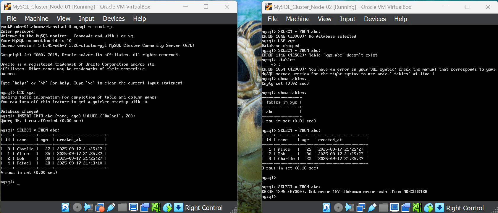
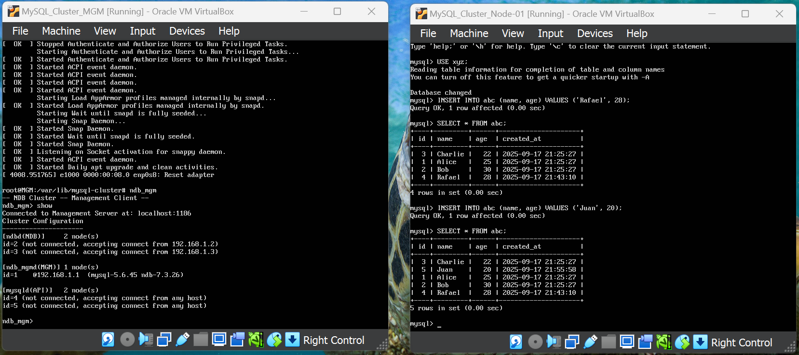
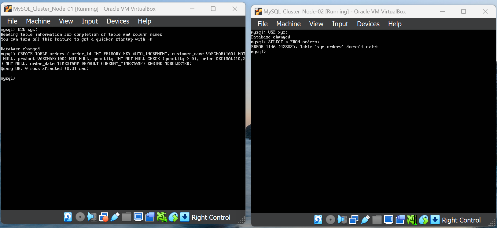
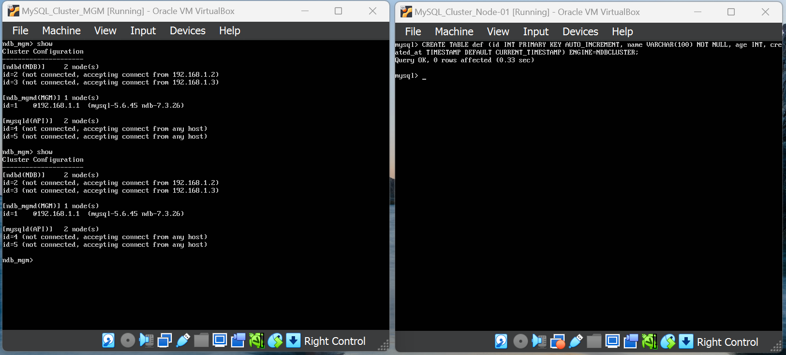
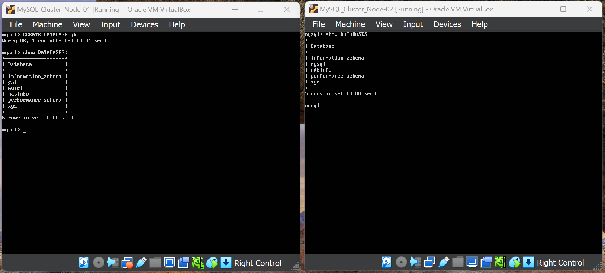
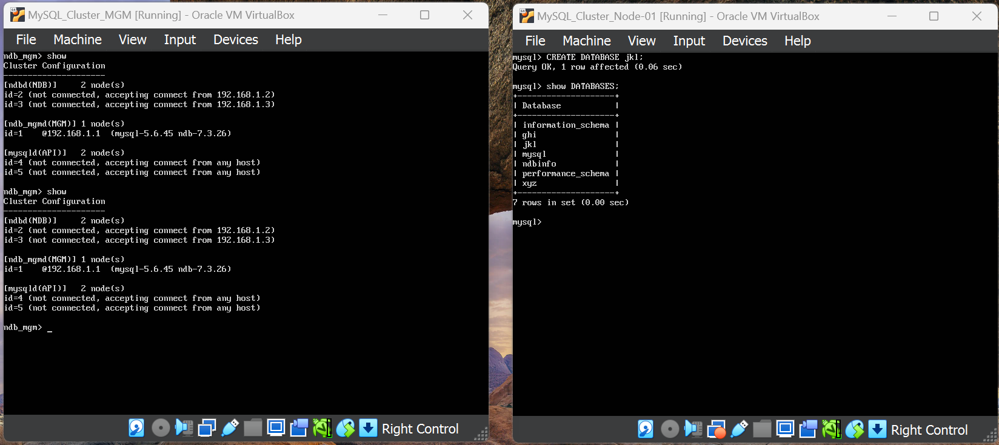
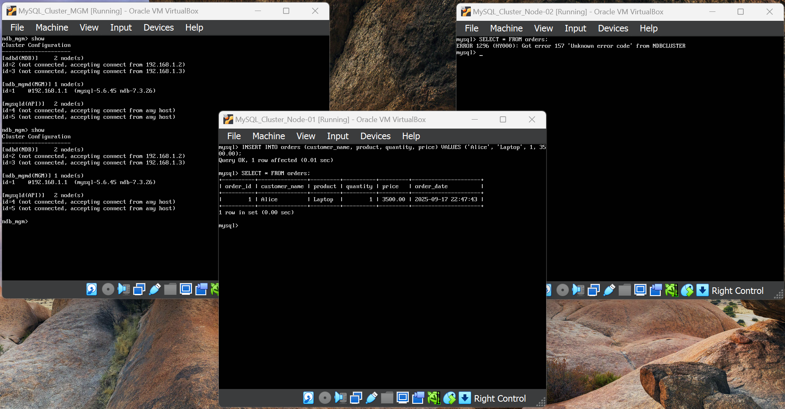
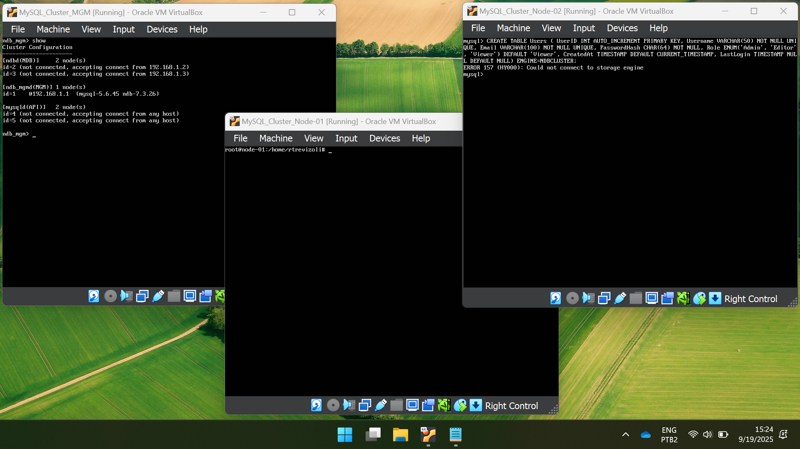
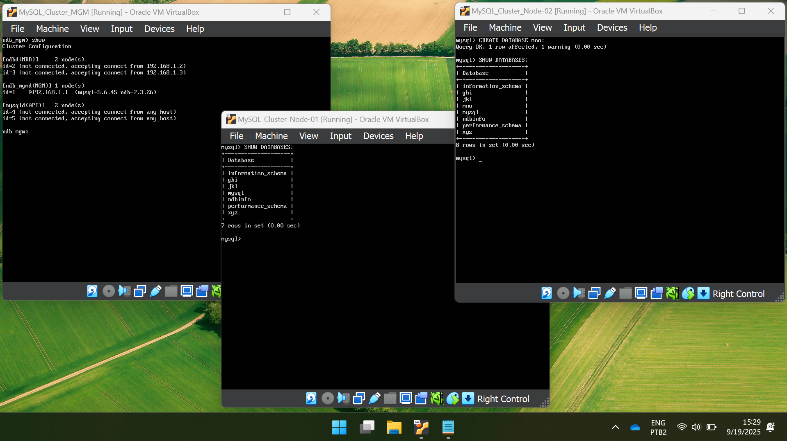
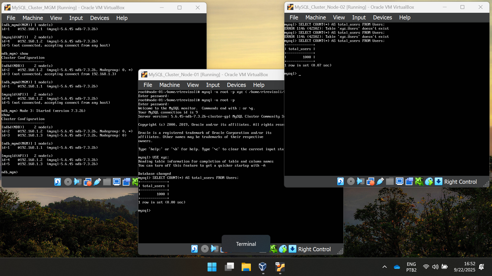

# EX 04 - Utilização MySQL Cluster
Rafael Trevizoli - 1460282423016  
Professor Diogo Branquinho Ramos

**Topic:**  MySQL Cluster  
**Lab:** [EX4 - Utilização MySQL Cluster.pdf](lab/EX4%20-%20Utilização%20MySQL%20Cluster.pdf)

## EX4 – Utilização do MySQL Cluster  
Comente os resultados obtidos para as situações a seguir:  

> ***Importante 1:*** Para a desconexão, ou status de desligado, estou desconectando o cabo virtual da interface ``internal`` para esecução dos procedimentos.  

> ***Importante 2:*** Nas etapas que descrevem apenas dois dos nós, estou assumindo que o terceiro, não mencionado, está ligado e conectado corretamente.  

### 1. INSERIR NO NO1 COM NO2 DESLIGADO  
O registro foi inserido com sucesso pelo ``node01``, todavia ao ser consultado no ``node02`` a query retornou a mensagem de erro a seguir:  

> ERROR 1296 (HY000): Got error 157 'Unknown error code' from NDBCLUSTER

     
    <em>Img 01 - Insert into node01 with node02 disconnected</em>

### 2. INSERIR NO NO1 COM O MGM DESLIGADO  
O registro foi inserido com sucesso pelo ``node01``, sem aparentes erros ou mensagens.

     
    <em>Img 02 - Insert into node01 with MGM disconnected</em>

   
### 3. CRIAR TABELA NO NO1 COM NO2 DESLIGADO
A tabela foi corretamente criada no ``node01`` e não foi criada no ``node02``.

     
    <em>Img 03 - Create table into node01 with node02 disconnected</em>

### 4. CRIAR UMA TABELA NO NO1 COM MGM DESLIGADO  
A tabela foi corretamente criada no ``node01`` e não houve ocorrência de erros no ``MGM``.  

     
    <em>Img 04 - Create table into node01 with MGM disconnected</em>

### 5. CRIAR UM DATABASE NO NO1 COM O NO2 DESLIGADO  
O database foi criado corretamente no ``node01`` e não houve alteração no ``node02``.

     
    <em>Img 05 - Create database into node01 with node02 disconnected</em>

### 6. CRIAR DATABASE NO NO1 COM O MGM DESLIGADO  
O database foi criado corretamente no ``node01`` e não houve alteração no ``MGM``.

     
    <em>Img 06 - Create database into node01 with MGM disconnected</em>

### 7. INSERIR NO NO1 COM TODO O RESTO DESLIGADO  
O registro foi inserido com sucesso no ``node01`` e não houve alerta ou alterações no ``MGM`` e ``node02``.  

     
    <em>Img 07 - Insert into node01 with all the others disconnected</em>

### 8. CRIAR TABELA NO NO2 COM TODO O RESTO DESLIGADO
Não foi possível criar a tabela e o comando retornou a seguinte mensagem de erro:

> ERROR 157 (HY000): Could not connect to storage engine

     
    <em>Img 08 - Create table into node02 with all the others disconnected</em>

### 9.  CRIAR DATABASE NO NO2 COM TODO O RESTO DESLIGADO
O database foi criado com sucesso no ``node02`` e não replicado no ``node01``.

     
    <em>Img 09 - Create database into node02 with all the others disconnected</em>

### 10.  INSERIR 1000 REGISTROS NO NO1 COM NO2 DESLIGADO, DEPOIS LIGAR O NO2 E OBSERVAR O RESULTADO
Com o ``node02`` desconectado utilizei o script [users_1000.sql](lab/assets/users_1000.sql) para criar a tabela ``xyz.Users`` e inserir 1000 registros na mesma.

#### Após conectar o ``node02``
Realizei algumas consultas em ``xyz.Users`` e rapidamente o registros foram criados. 
> SELECT COUNT(*) AS total_users FROM Users;

     
    <em>Img 10 - Insert 1k lines into Users node01 than connect node02</em>

### 11.  DESCREVER SOBRE A NECESSIDADE DO MGM
Aparentemente o MGM faz o papel de manager da engine que se responsabilizado por replicar os dados entre os nós. 
