# EX 05 - MySQL Fragmentação Horizontal
Rafael Trevizoli - 1460282423016  
Professor Diogo Branquinho Ramos

**Topic:**  MySQL Fragmentação Horizontal  
**Lab:** [EX5 - MySQL Fragmentação Horizontal.pdf](lab/EX5%20MySQL%20Fragmentação%20Horizontal.pdf)

## EX5 – MySQL Fragmentação Horizontal

> ***Importante 1:*** As etapas abaixo descritas estão sendo executadas com todos os três nós ligados e conectados.  

> ***Importante 2:*** Criado schema `ex05` no nó 01 para execução dos passos abaixo.

### Fragmentação Horizontal por ID automático
```SQL
CREATE TABLE ALUNO (ID INT NOT NULL AUTO_INCREMENT PRIMARY KEY, NOME
VARCHAR(10), IDADE INT) ENGINE=NDBCLUSTER PARTITION BY KEY (ID);
```

<p align="center">
    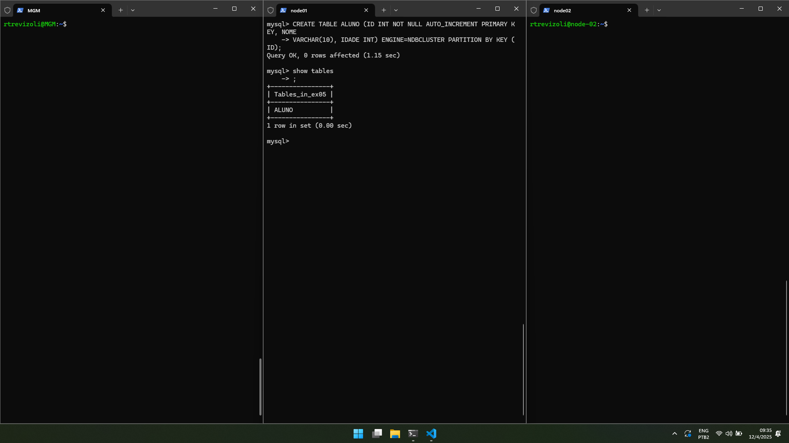<br>
    <em>Img 01 - Create table aluno partioned by ID in node01</em>
</p>

#### 1. Insira pelo menos 15 registros
```SQL
INSERT INTO ALUNO (NOME, IDADE) VALUES
('Ana', 20), ('Bruno', 22), ('Carla', 19), ('Daniel', 21), ('Eva', 23),
('Felipe', 20), ('Gabi', 18), ('Hugo', 24), ('Iara', 22), ('Joao', 19),
('Katia', 20), ('Leo', 21), ('Mara', 23), ('Nina', 22), ('Otavio', 24);
```

<p align="center">
    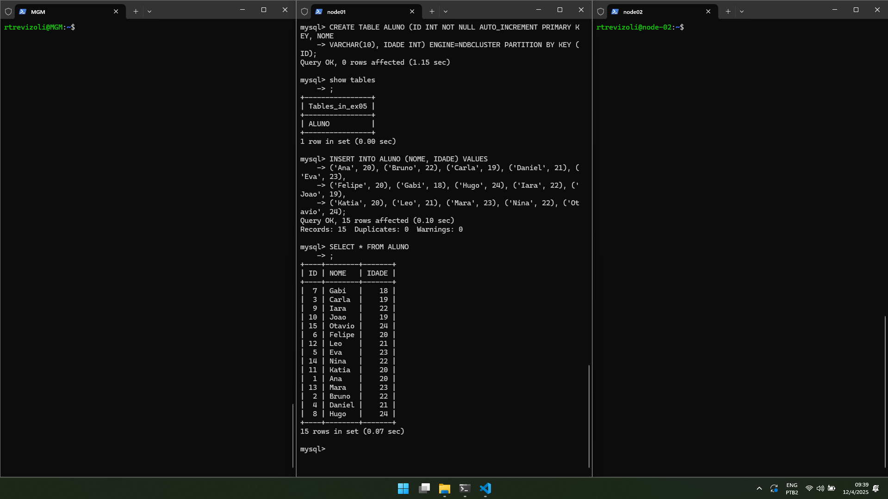<br>
    <em>Img 02 - Insert 15 lines in ex05.ALUNO, node01</em>
</p>

#### 2. Verifique a consistência nos nós
* Alternativa A: Utilizando `ndbinfo.logbuffers`
    Mostra a consistência de replicação entre os nós.

    ```SQL
    SELECT * FROM ndbinfo.logbuffers;
    ```

    Se as repicações estiverem corretas:
    * `Used` não vai crescer indefinidamente;
    * Não haverá backlog excessivo;
    * Não haverá padrões de "gap"

    <p align="center">
        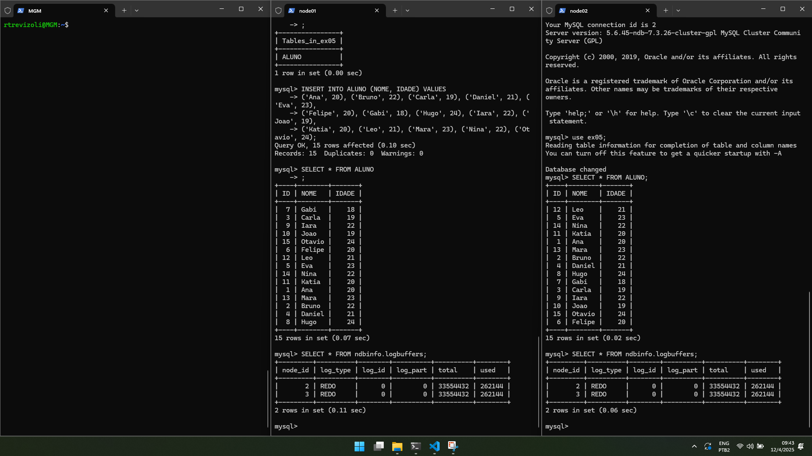<br>
        <em>Img 03 - Check consistency using logbuffers, node01</em>
    </p>

* Alternativa B: Verificar o status dos nós no **MGM** (Nó de gerenciamento)
    No nó de gerenciamento:
    ```bash
    ndb_mgm
    ```

    Então:
    ```bash
    ALL STATUS
    ```

    Se houver inconsistência em uma réplica, será exibido:  
    * `not started`;
    * `start phase...`;
    * `NR` (Not-Recovering);
    * `SUSPECT` ou `FAILED`.

    <p align="center">
        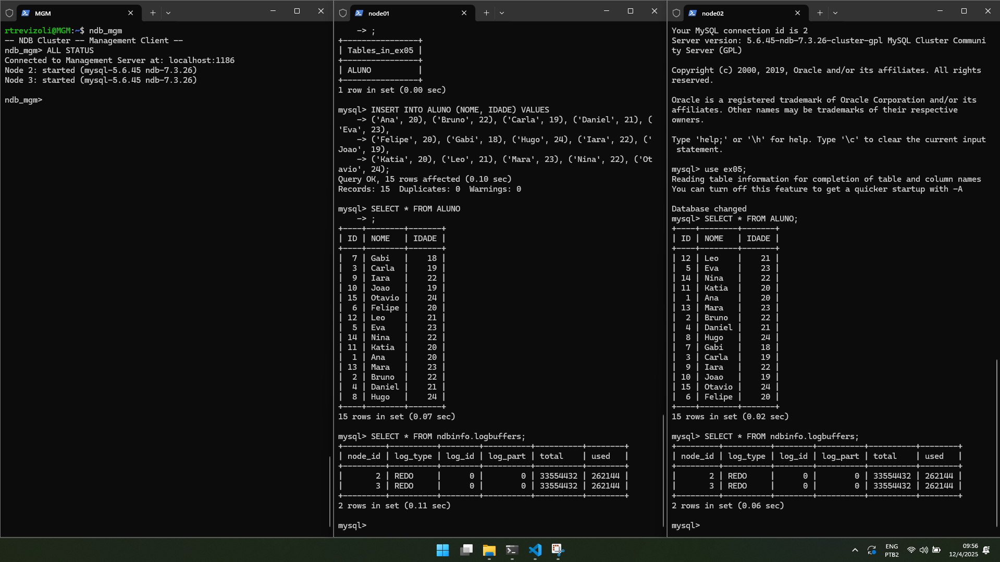<br>
        <em>Img 04 - Check consistency using ndb_mgm, mgm</em>
    </p>

#### 3. Como verificar o que foi armazenado em cada nó?
##### 3.1. O comando abaixo mostrará quantos registros estão alocados fisicamente em cada nó
```SQL
select partition_name, table_rows from information_schema.PARTITIONS
where table_name = 'ALUNO';
```

<p align="center">
    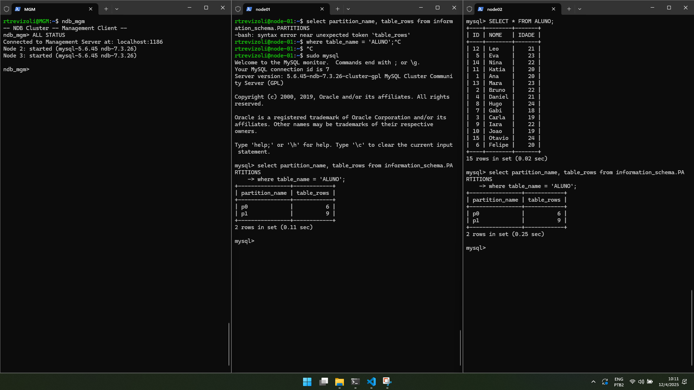<br>
    <em>Img 05 - Verify what were the inserts in each node</em>
</p>

##### 3.2. O comando abaixo mostrará para cada registro onde ele está armazenado
```SQL
explain partitions select * from ALUNO where id = 1;
```

<p align="center">
    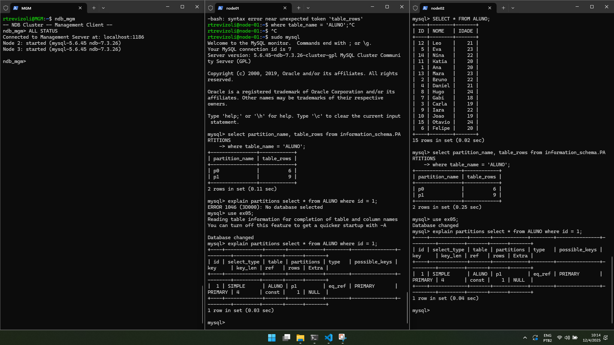<br>
    <em>Img 06 - Explain partitions on table ALUNO</em>
</p>

#### 4. Faça as mesmas verificações para uma tabela replicada por completo.
Tabela replicada por completo:
```SQL
CREATE TABLE FRT_ALUNO (
  ID INT NOT NULL AUTO_INCREMENT PRIMARY KEY,
  NOME VARCHAR(10),
  IDADE INT
) ENGINE=NDBCLUSTER
COMMENT='NDB_TABLE=FULLY_REPLICATED';
```
<p align="center">
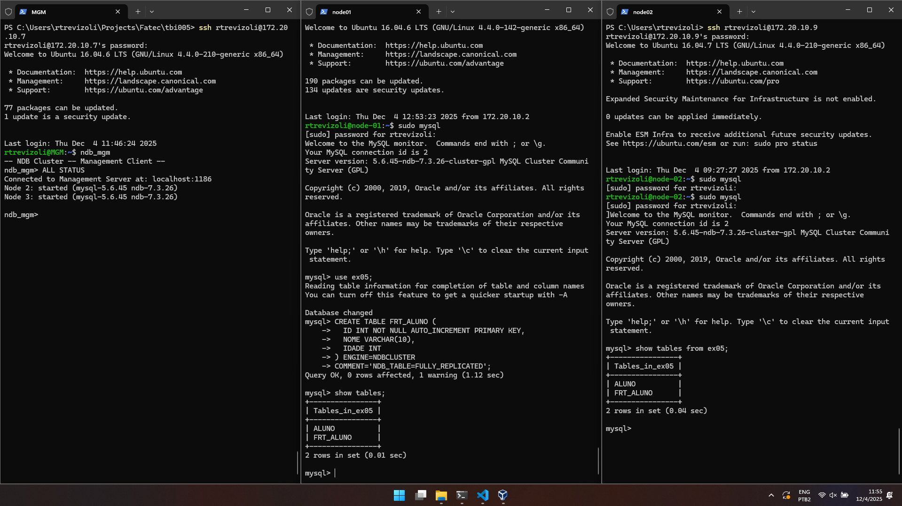<br>
<em>Img 07 - Create table FRT_ALUNO full replicated in node 01</em>
</p>

* 1. Insira pelo menos 15 registros
  ```SQL
  INSERT INTO FRT_ALUNO (NOME, IDADE) VALUES
  ('Ana', 20), ('Bruno', 22), ('Carla', 19), ('Daniel', 21), ('Eva', 23),
  ('Felipe', 20), ('Gabi', 18), ('Hugo', 24), ('Iara', 22), ('Joao', 19),
  ('Katia', 20), ('Leo', 21), ('Mara', 23), ('Nina', 22), ('Otavio', 24);
  ```

  <p align="center">
    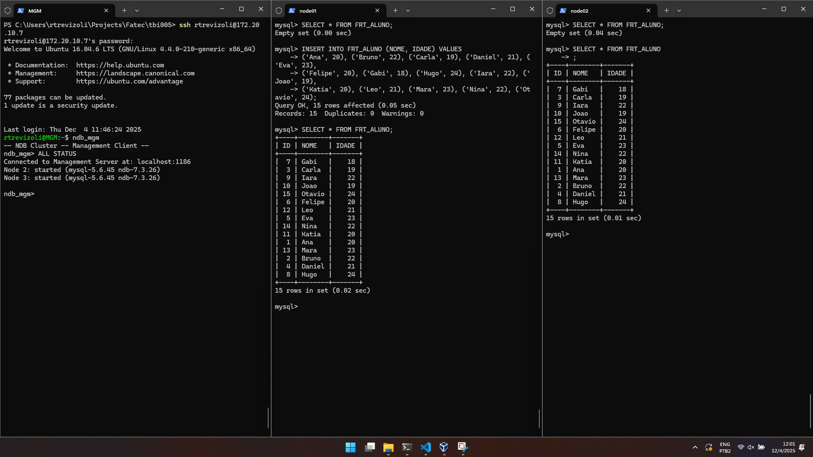<br>
    <em>Img 08 - Insert 15 lines in ex05.FRT_ALUNO, node01</em>
  </p>

* 2. Verifique a consistência nos nós

  * Alternativa A: Utilizando `ndbinfo.logbuffers`
  * Alternativa B: Verificar o status dos nós no **MGM** (Nó de gerenciamento)

<p align="center">
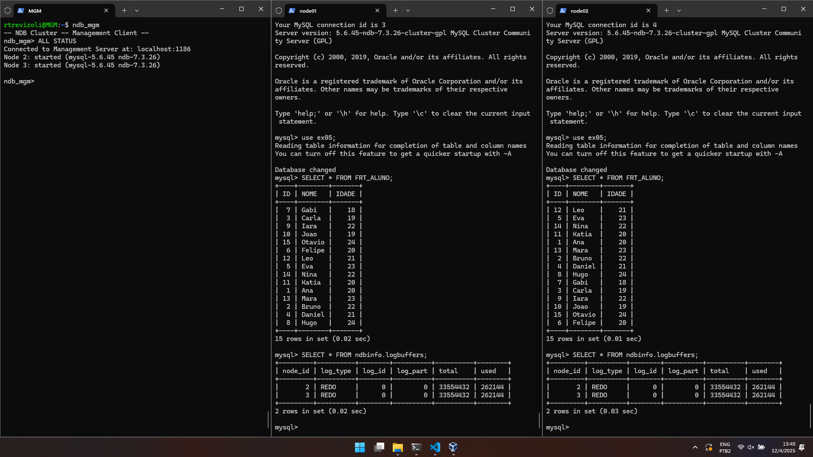<br>
<em>Img 09 - Check node consistency using A and B approach</em>
</p>


* 3. Como verificar o que foi armazenado em cada nó?

  * 3.1. O comando abaixo mostrará quantos registros estão alocados fisicamente em cada nó

  <p align="center">
    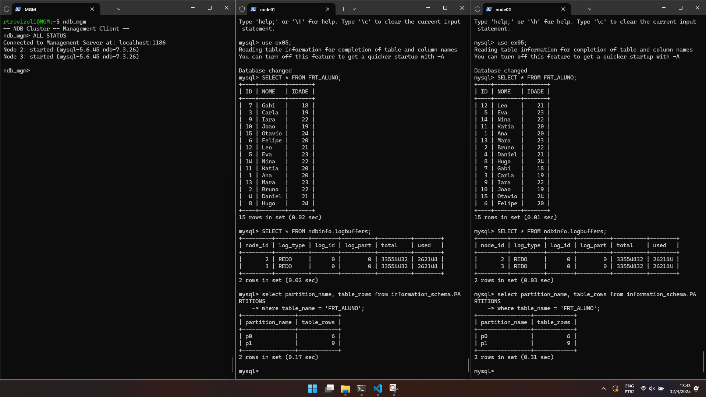<br>
    <em>Img 10 - Verify what were the inserts in each node</em>
  </p>

  * 3.2. O comando abaixo mostrará para cada registro onde ele está armazenado

  <p align="center">
    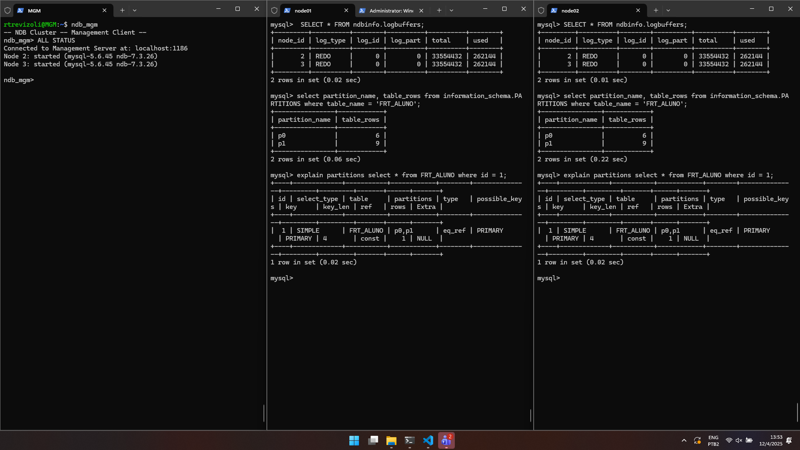<br>
    <em>Img 11 - Explain partitions on table FRT_ALUNO</em>
  </p>

