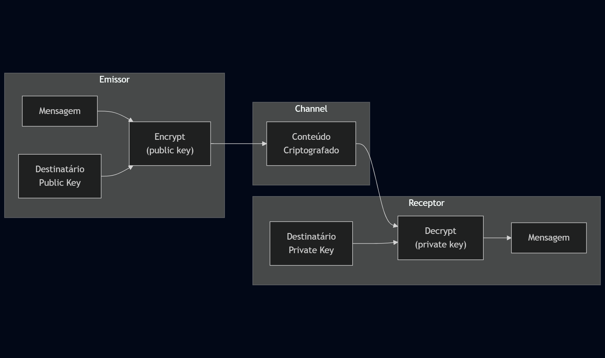

# EX 06 - Criptografia e Socket
Rafael Trevizoli - 1460282423016  
Professor Diogo Branquinho Ramos

**Topic:** Criptografia e Socket  
**Lab:** [EX6 - Criptografia e Socket.pdf](lab/EX6-2.pdf)

## EX6 - Criptografia e Socket

> ***Importante 1:*** Exemplos encontram-se no GitHub: [@diogobranquinho](http://github.com/diogobranquinho)

### Criptografia
> GitHub: [@rtrevizoli/Encryption](https://github.com/rtrevizoli/Encryption/).

#### 1. Elabore um programa ilustrando a geração de chaves, criptografando e descriptografando os dados.  

##### a. Explique o código fonte utilizado;  
Utilizado python como linguagem principal pela simplicidade e as biblotecas **rsa**, **pathlib** e **argparse**.

* `rsa` foi utilizada para a principal funcionalidade do programa, a geração de pares de chave assimétricas.
* `pathlib` foi utilizado para a sanitização dos arquivos e caminhos, assim como para confirmar a exsistência do arquivo e a opção em sobrescrever o mesmo.
* `argparse` foi utilizado para trazer um comportamento de programa de linha de comando, onde os principais inputs do usuário são informados.

##### b. Descreva os resultados obtidos.
Com a execução deste programa é possível a geração de pares de chaves assimétricas, podendo ser utilizadas para criptografar e descriptografar mensagens e arquivos pelos detentores das mesmas.

 
<em>Img 01 - Encription flowchart</em>

### Socket
> GitHub: [@rtrevizoli/Socket](https://github.com/rtrevizoli/Socket/).

#### 1. Elabore um programa ilustrando a conexão socket UDP entre dois processos.  
##### a. Explique o código fonte utilizado;  
Para a implementação UDP foi utilizado o exemplo do repositório oficial do professor. A comunicação ocorre sem conexão (connectionless), característica própria do protocolo UDP.

O código do servidor cria um socket do tipo `SOCK_DGRAM` e o associa a uma porta específica utilizando `bind()`. Em seguida, entra em um loop recebendo datagramas com `recvfrom()`, onde cada pacote contém tanto a mensagem quanto o endereço do cliente.

O cliente, por sua vez, também cria um socket UDP, prepara a mensagem em formato de bytes e utiliza `sendto()` indicando explicitamente o endereço e porta do servidor. A aplicação é simples e direta, pois não existe estabelecimento de conexão como no TCP, o que torna o fluxo mais performático, porém sem garantias de entrega.

##### b. Descreva os resultados obtidos.
Durante os testes, a troca de mensagens ocorreu conforme esperado: o cliente enviou datagramas ao servidor, que os recebeu sem necessidade de handshake prévio. Observou-se também o comportamento característico do UDP: não existe confirmação de recebimento, o que reforça seu uso em cenários onde velocidade e simplicidade são mais importantes que confiabilidade, como transmissões de áudio/vídeo ou telemetria.

#### 2. Elabore um programa ilustrando a conexão socket TCP entre dois processos.  
##### a. Explique o código fonte utilizado;  
A implementação TCP utilizou também os exemplos fornecidos. O servidor TCP inicia criando um socket `SOCK_STREAM`, realiza o `bind()` e passa a escutar conexões com `listen()`. Quando um cliente tenta conectar, o servidor executa `accept()`, que retorna um novo socket dedicado exclusivamente àquela sessão.

No cliente, o funcionamento complementa o servidor: após criar um socket TCP, ele executa `connect()` informando o IP e porta. Uma vez estabelecida a conexão, cliente e servidor utilizam `send()` e `recv()` para troca de dados de forma sequencial e confiável, já que o TCP garante entrega, ordem e integridade das mensagens.

##### b. Descreva os resultados obtidos.
Nos testes, verificou-se a diferença clara entre TCP e UDP. A comunicação ocorreu apenas após o estabelecimento da conexão, e todas as mensagens enviadas pelo cliente chegaram ao servidor exatamente na mesma ordem, demonstrando a característica de confiabilidade do protocolo. A troca de dados foi contínua enquanto a conexão permaneceu aberta, encerrando apenas quando uma das partes finalizou o socket.

#### 3. Elabore um programa ilustrando a conexão socket TCP de servidor com thread.  
##### a. Explique o código fonte utilizado;  
Nesta versão, a implementação TCP foi estendida para suportar múltiplas conexões simultâneas. O servidor mantém a mesma lógica de criação do socket, `bind()`, `listen()` e `accept()`, porém para cada cliente conectado é criada uma nova thread, permitindo que diversas sessões sejam atendidas paralelamente.

Cada thread recebe o socket específico daquele cliente e processa suas mensagens de forma isolada, sem bloquear o fluxo principal do servidor. Essa abordagem espelha arquiteturas reais de servidores TCP, onde concorrência é essencial para escalabilidade.

##### b. Descreva os resultados obtidos.
Os testes demonstraram que o servidor consegue atender vários clientes simultaneamente, cada um mantendo seu próprio canal de comunicação. As mensagens trocadas entre diferentes clientes não interferem entre si, comprovando o isolamento proporcionado pelas threads. Observou-se também que o servidor permanece sempre disponível para novos clientes enquanto as threads existentes continuam processando conexões já estabelecidas.
