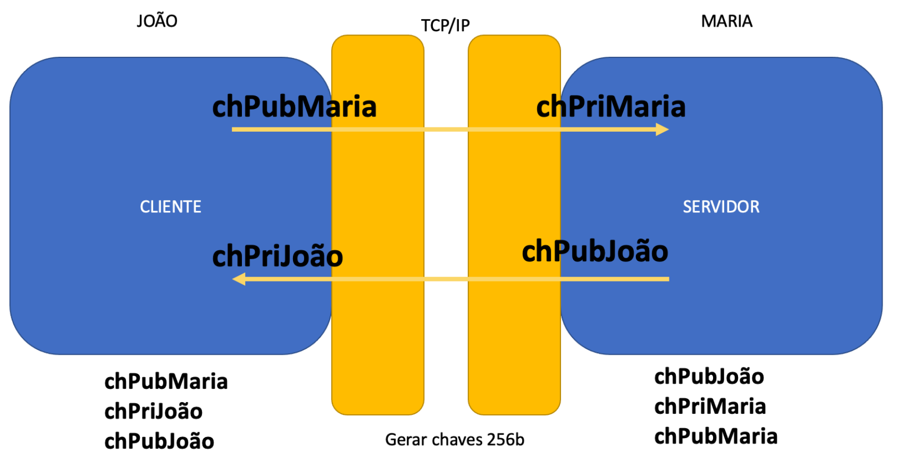
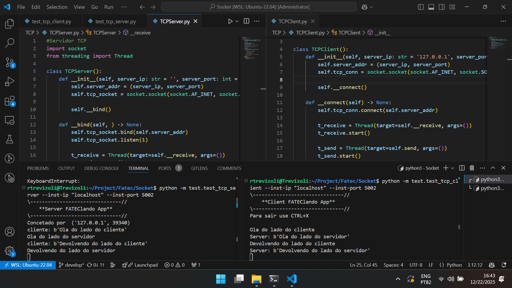

# EX 07 - FATEClando App
Rafael Trevizoli - 1460282423016  
Professor Diogo Branquinho Ramos

**Topic:** FATEClando App  
**Lab:** [EX7 - FATEClando App.pdf](lab/EX7.pdf)

## EX7 - FATEClando App

> ***Importante 1:*** Este atividade utiliza os projetos desenvolvidos nas atividades anteriores ([EX 06 - Criptografia e Socket](https://github.com/rtrevizoli/tbi005/blob/develop/ex6/REPORT.md)):
> * Para criptografia: [@rtrevizoli/Encryption](https://github.com/rtrevizoli/Encryption/);
> * Para sockets: [@rtrevizoli/Socket](https://github.com/rtrevizoli/Socket/).


> ***Importante 2:*** Os pares de chave foram gerados utilizando o script [KeyGenerator.py]() disponível no projeto [@rtrevizoli/Encryption](https://github.com/rtrevizoli/Encryption/).

### Parâmetros para Geração de Chaves
#### João
```bash
python KeyGenerator.py --path "./keys/Ex7/" --key-name "JOAO" --size 256
```
#### Maria
```bash
python KeyGenerator.py --path "./keys/Ex7/" --key-name "MARIA" --size 256
```

### Diagrama de Arquitetura
<p align="center">
    <br>
    <em>Img 01 - Diagrama de arquitetura FATEClando App</em>
</p>

### Exemplo de comunicação
<p align="center">
    <br>
    <em>Img 02 - Exemplo de comunicação com FATEClando App</em>
</p>

