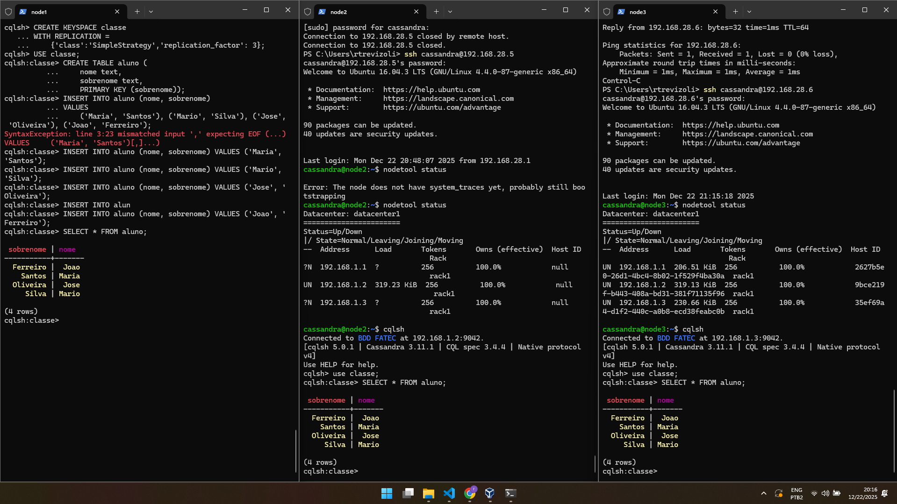
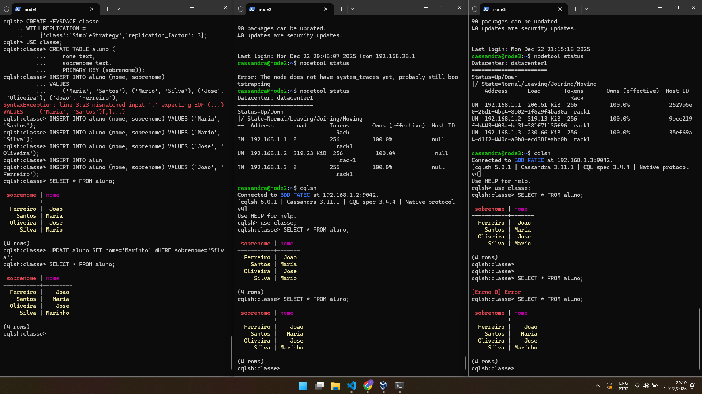
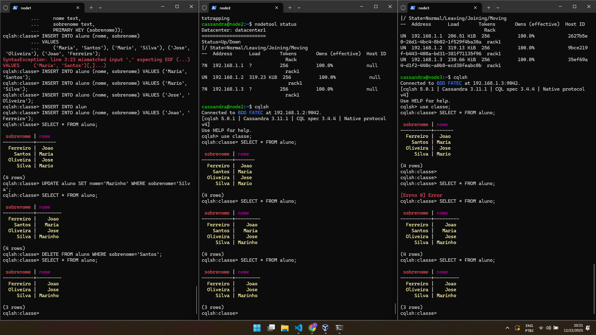
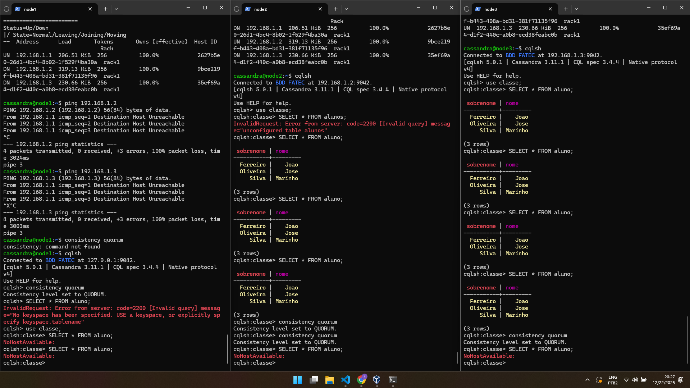
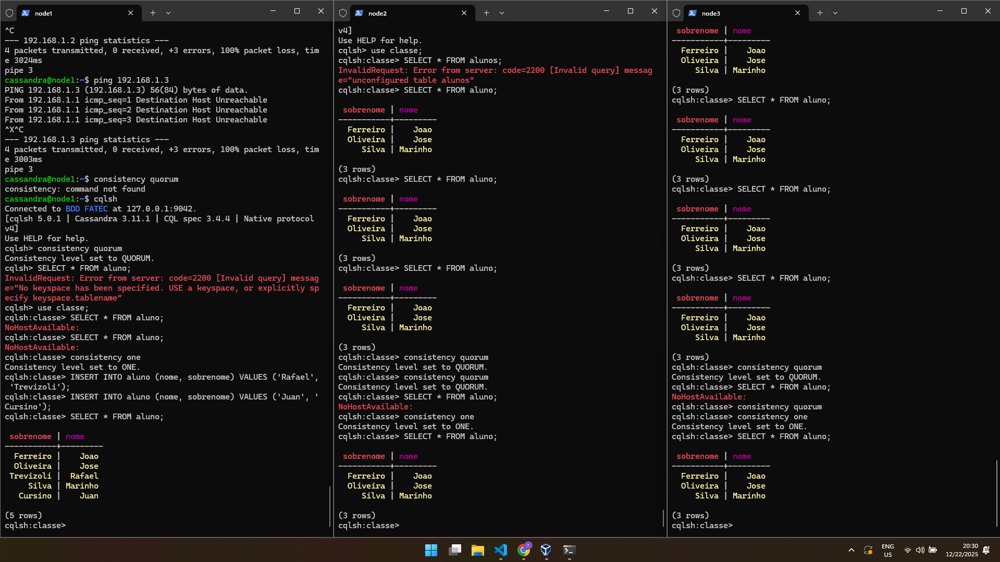
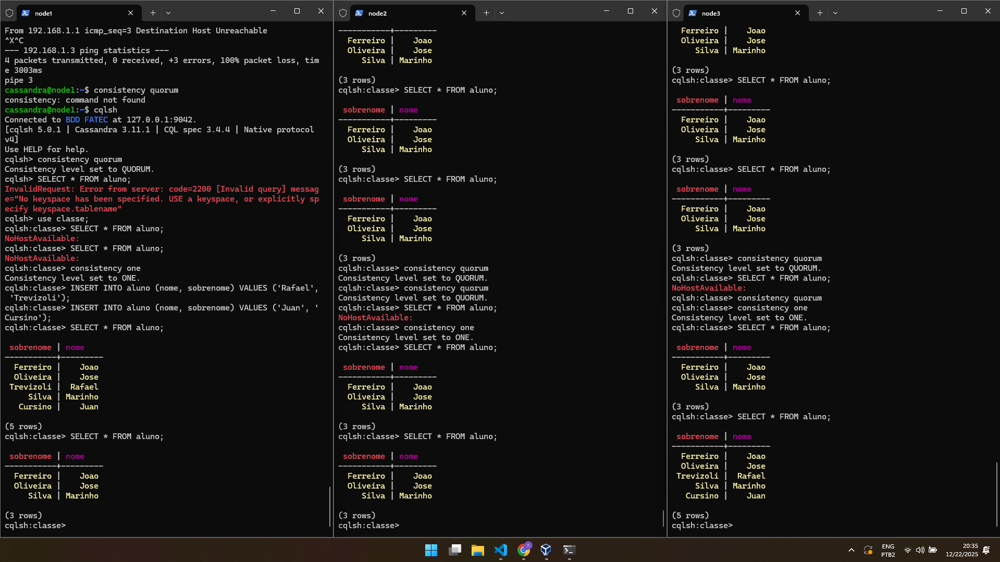

# EX 08 - Cassandra
Rafael Trevizoli - 1460282423016  
Professor Diogo Branquinho Ramos

**Topic:** Cassandra  
**Lab:** [EX8 - Cassandra.pdf](lab/EX8A.pdf)  
**Procedimentos de Instalação VM:** [Cassandra Configuração e Uso-V3.pdf](lab/Cassandra%20Configuração%20e%20Uso-V3.pdf)

> **Importante 01:** Máquinas configuradas com usuário `cassandra` e senha `123456`.

> **Importante 02:** Para as máquinas foram utilizados as seguintes configurações:
> * **Cassandra_Cluster_Node-01:**
>   * hostname: node1
>   * enp0s3 IPv4: 192.168.15.78
>   * enp0s8 IPv4: 192.168.1.1
>   * enp0s9 IPv4: 192.168.28.4
> 
> * **Cassandra_Cluster_Node-02:**
>   * hostname: node2
>   * enp0s3 IPv4: 192.168.15.79
>   * enp0s8 IPv4: 192.168.1.2
>   * enp0s9 IPv4: 192.168.28.5
> 
> * **Cassandra_Cluster_Node-03:**
>   * hostname: node3
>   * enp0s3 IPv4: 192.168.15.80
>   * enp0s8 IPv4: 192.168.1.3
>   * enp0s9 IPv4: 192.168.28.6

> **Importante 03:** Dos procedimentos listados abaixo, estou assumindo que no passo onde não é específicado, o comando deve ser executado no nó 01, ou seja `node1`

## EX8 - Cassandra
### Comando para entrar no shell do Cassandra
```bash
cqlsh
```

### Criando a Keyspace
```SQL
CREATE KEYSPACE classe
WITH REPLICATION = 
    {'class':'SimpleStrategy','replication_factor': 3};
```

### Para utilizar a keyspace
```SQL
USE classe;
```

### Column Families
Agora vamos criar as tabelas (column families) dentro da keyspace
```SQL
CREATE TABLE aluno (
    nome text,
    sobrenome text,
    PRIMARY KEY (sobrenome));
```

### Inserção de dados
```SQL
INSERT INTO aluno (nome, sobrenome) VALUES ('Maria', 'Santos');
```
```SQL
INSERT INTO aluno (nome, sobrenome) VALUES ('Mario', 'Silva');
```
```SQL
INSERT INTO aluno (nome, sobrenome) VALUES ('Jose', 'Oliveira');
```
```SQL
INSERT INTO aluno (nome, sobrenome) VALUES ('Joao', 'Ferreiro');
```

### Seleção dos dados
```SQL
SELECT * FROM aluno;
```

### Verifique nos outros nós a replicação dos dados
<p align="center">
    <br>
    <em>Img 01 - Replicação de dados entre os nós, após INSERT</em>
</p>

### Atualização dos dados
```SQL
UPDATE aluno SET nome='Marinho' WHERE sobrenome='Silva';
```

<p align="center">
    <br>
    <em>Img 02 - Replicação de dados entre os nós, após UPDATE</em>
</p>

### Deleção de dados
```SQL
DELETE FROM aluno WHERE sobrenome='Santos';
```

<p align="center">
    <br>
    <em>Img 03 - Replicação de dados entre os nós, após DELETE</em>
</p>

### Testando a consistência
1. Experimente desconectar a placa de rede na máquina virtual para tornar o node off line. Faça isso em dois nodes.

2. No node on line abra o cqlsh e mude a consistência. Vamos configurar para o sistema de consistência do tipo `Quorum (maior que 51%)`.
```SQL
consistency quorum
```

3. Experimente realizar uma busca ou inserção, provavelmente a resposta, para dois nós off line, será:
```bash
cqlsh> NoHostAvailable
```
<p align="center">
    <br>
    <em>Img 04 - Configurando  consistency level para QUORUM</em>
</p>

4. Agora com a consistência tipo ONE, basta um nó on line:
```SQL
consistency one
```

Experimente realizar uma busca ou inserção, provavelmente a reposta, será positiva.

<p align="center">
    <br>
    <em>Img 05 - Tabela aluno após INSERT com consistency level em ONE</em>
</p>

5. Ao reconectar as placas de rede dos nodes, os dados serão replicados de acordo com o replication factor definido

<p align="center">
    <br>
    <em>Img 06 - Replicação de dados após religar as interfaces de rede dos nós node2 e node3</em>
</p>

### Resultado do comando nodetool status
Mostra o cluster com 3 nós ativos (UN: Up/Normal), todos no mesmo datacenter, com carga distribuída e tokens balanceados entre os nós, indicando cluster saudável.

### Resultado do comando nodetool –h localhost ring
Exibe o anel de tokens (ring) do Cassandra, mostrando cada nó, seus tokens atribuídos e a participação de cada um no particionamento dos dados no cluster.

### Resultado da criação de uma keyspace com replication factor = 3
A keyspace é criada com replicação total dos dados nos 3 nós do cluster, garantindo alta disponibilidade e tolerância a falhas, pois cada dado possui 3 réplicas distribuídas.